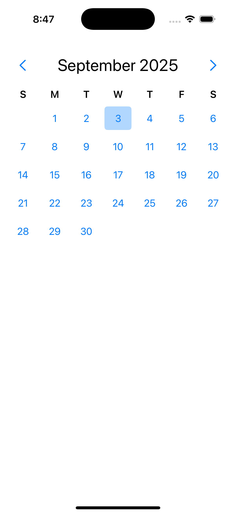
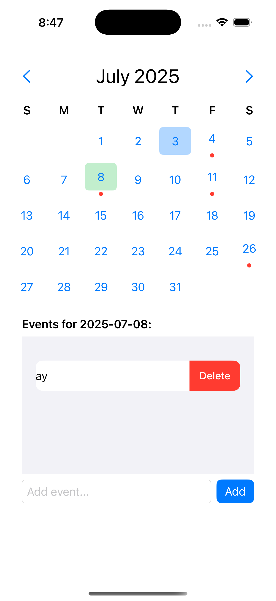
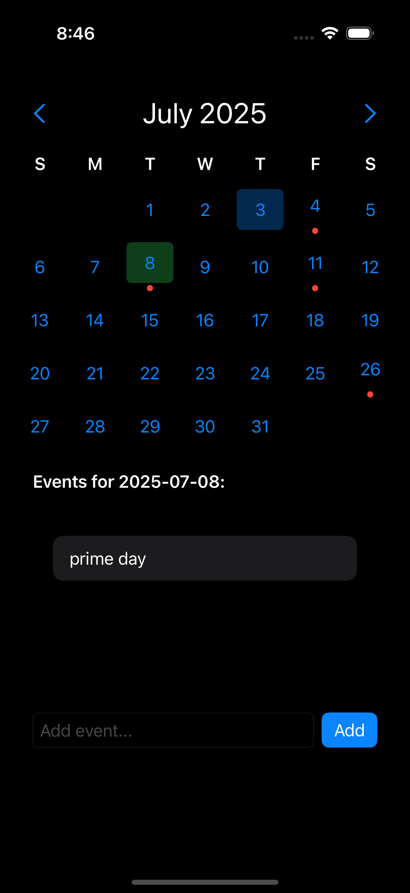

# 📅 CalendyCalendar

CalendyCalendar is a customizable calendar app that lets you navigate months, select dates, and add events with persistent storage. Perfect for simple scheduling or learning how to build interactive calendars in SwiftUI.

---

## ✨ Features

- Navigate between months with smooth UI.
- Select dates by tapping on days.
- Add, view, and delete events for each date.
- See indicators (dots) under days with events.
- Persistent event storage with `UserDefaults`.
- Dismiss the keyboard by tapping outside text fields.
- Automatically highlights the current day.

---

## 📸 Screenshots
  
